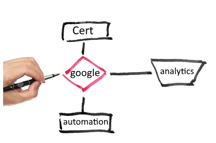

------------------------------------------------------------------
👋 Hi, I’m @araderberg
👀 This repository is a collection of professional certificates and training from LinkedIn, Udemy, Coursera and any other service provider from Decenber 2023 to present.

🌱 I’m currently working in the following certifications: Copy of the certifications will be uploaded here --> https://github.com/araderberg/Certificates

📊 - Google Data Analytics Professional Certificate 
🎓 - SAS Certification 
📜 - Google IT Data Automation using Python 
🌐 - AWS Cloud 
📊 - Tableau Data Visualization 

💞️ I’m looking to collaborate on clinical research / data management / Artificial Intelligence projects.

📫 How to reach me: datamanagersasprogrammer [at] protonmail [dot] ch
